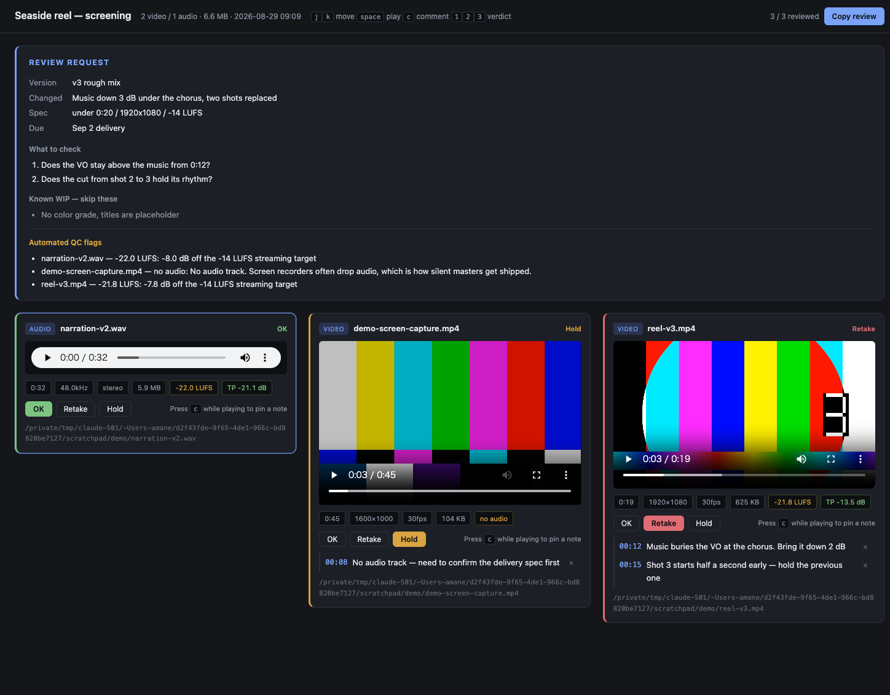

# media-preview

A Claude Code and Codex skill that turns generated video, audio, and images into a **screening page** — one local HTML file with a review brief, timecoded notes, and automated QC. No upload, no size limit, no service to sign up for.



## Why

When an agent generates media, it usually hands back a list of paths. Opening each file, remembering which take was which, and typing "the music is too loud somewhere in the middle" back into chat is the slow part of the loop.

But the deeper problem is that **a list of files is not a review request**. Film and music post-production solved this a long time ago: you state the version and stage, scope the ask to a few points, declare what is still work in progress, and every note is anchored to a timecode. This skill makes the agent follow that form.

## What it does

**Enforces a review brief.** The page opens with version, stage, what changed, spec, deadline, the 1-3 things to check, and what is still WIP so the reviewer skips it. If the agent forgets to scope the ask, the tool prints a warning.

**Anchors notes to timecodes.** Press `c` while playing and the note is pinned to that moment. Clicking the timecode later replays from there. `- 02:51 Music buries the VO` beats "the music is too loud".

**Three verdicts.** OK / Retake / Hold, mirroring approve / request changes / needs review. Press `1`, `2`, or `3`.

**Runs QC before a human looks.** Duration, resolution, fps, EBU R128 integrated loudness against the -14 LUFS streaming target, true peak against -1 dBTP, and **missing audio tracks** — the failure that ships silent masters. Flags surface at the top of the page.

**Gives the reply back as Markdown.** "Copy review" produces a summary ordered Retake → Hold → OK, ready to paste into the chat so the agent can act on it.

Verdicts and notes persist in `localStorage`, so closing the tab loses nothing.

## Install

### Claude Code

```
/plugin marketplace add isaka1022/media-preview
/plugin install media-preview@amane-media-tools
```

### Codex

Ask Codex to install the self-contained skill directory from this repository:

```
$skill-installer install https://github.com/isaka1022/media-preview/tree/main/skills/media-preview
```

Restart Codex after installation so the new skill is discovered. The skill can
then trigger automatically, or be invoked explicitly with `$media-preview`.

The skill triggers on its own after the agent generates or exports media, or when you ask for a preview, a screening, or to review a take.

## Requirements

- Node.js 18+
- `ffmpeg` / `ffprobe` — optional. Without them you still get playback and file sizes, but no duration, resolution, or loudness

## Standalone usage

The script is a standalone CLI with no dependencies:

```bash
node scripts/preview-media.mjs ./renders \
  --title "Nachi Falls MV — screening" \
  --version "v3 rough cut" \
  --ask "Does the retake at 2:51 read as a deliberate quality call?" \
  --wip "No color grade, titles are placeholder" \
  --spec "under 4:00 / 1920x1080 / -14 LUFS" \
  --due "Aug 31 delivery" \
  --loudness
```

| Option | Meaning |
|---|---|
| `--version` | Version and stage, e.g. `"v3 rough cut"` |
| `--ask "..."` | What to check. Repeatable. Keep it to 1-3 |
| `--wip "..."` | Known WIP the reviewer should skip. Repeatable |
| `--spec` / `--due` / `--changes` | Spec / deadline / what changed since last version |
| `--loudness` | Measure EBU R128. Pass it whenever sound is under review |
| `--since <minutes>` | Only files touched in the last N minutes |
| `--title` / `--out` / `--no-open` | Heading / output path / skip opening the browser |

Paths may be files or directories. Directories recurse 4 levels, skipping `node_modules`, `.git`, `dist`, and dotfiles.

Handles video (`mp4` `mov` `webm` `m4v` `mkv`), audio (`mp3` `wav` `m4a` `aac` `flac` `ogg` `opus`), and images (`png` `jpg` `jpeg` `gif` `webp` `avif`).

## Controls

| Key | Action |
|---|---|
| `j` / `k` | Move between cards |
| `space` | Play / pause the selected card |
| `c` | Pin a note at the current position |
| `1` / `2` / `3` | OK / Retake / Hold |

Only one stream plays at a time, so a screening never becomes overlapping audio.

## Output

```markdown
# Review — Seaside reel — screening (v3 rough mix)

## [Retake] reel-v3.mp4
`/path/to/reel-v3.mp4`
- 00:12 Music buries the VO at the chorus. Bring it down 2 dB
- 00:15 Shot 3 starts half a second early — hold the previous one

## [Hold] demo-screen-capture.mp4
`/path/to/demo-screen-capture.mp4`
- 00:08 No audio track — need to confirm the delivery spec first

## [OK] narration-v2.wav
`/path/to/narration-v2.wav`
- (no notes)
```

## Privacy

Everything stays on your machine. Nothing is uploaded, and the page contacts no network at all — no CDN, no fonts, no analytics.

Two consequences worth knowing:

- **The generated HTML embeds absolute local paths** and points at your media through `file://` URLs. It is a local artifact. Sending the HTML to someone else leaks your directory layout, and the media will not play on their machine anyway
- **Verdicts and notes live in `localStorage`** on the page's own origin, so they never leave the browser. Clearing site data drops them

## Security

- Filenames and every brief field are HTML-escaped before rendering, and values interpolated into the page's inline `<script>` have `<` escaped so a `</script>` in a title cannot break out
- Notes are inserted with `textContent`, never `innerHTML`
- `ffprobe` and `ffmpeg` are invoked through `execFile` with an argument array, so no filename reaches a shell

## License

MIT
